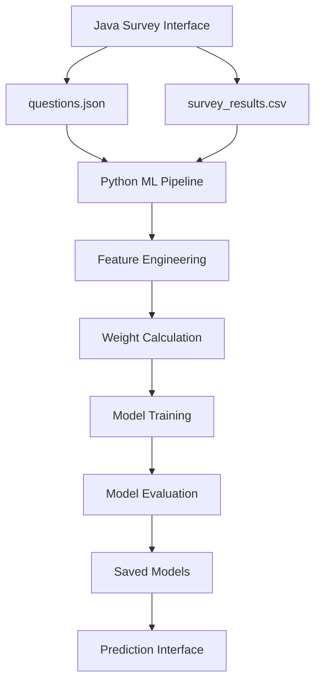

# Political Affiliation Survey - Machine Learning Implementation

## Overview

This project implements a comprehensive machine learning solution for classifying political affiliations based on survey responses. The system uses multiple ML algorithms with advanced feature engineering and weighted scoring methods.

## Machine Learning Approach

### 1. Model Selection & Justification

**Primary Model: Random Forest Classifier**

**Why Random Forest?**

- **Handles categorical features well**: Survey responses (A/B/C/D) are naturally categorical
- **Feature importance**: Provides insights into which questions are most predictive
- **Robust to overfitting**: Especially important with limited survey data
- **Non-linear relationships**: Can capture complex political preference patterns
- **Ensemble method**: Combines multiple decision trees for better generalization

**Alternative Models Implemented:**

- **Naive Bayes**: Good baseline for categorical data with independence assumptions
- **Decision Trees**: Interpretable but prone to overfitting
- **Logistic Regression**: Linear relationships, good for probability estimates

### 2. Feature Engineering & Weighted Responses

#### Advanced Feature Engineering:

1. **Political Dimension Scores**:

   - `economic_conservatism`: Combines Q1, Q2, Q9 (tax, economy, spending)
   - `social_conservatism`: Combines Q3, Q10, Q11 (abortion, LGBTQ+, policing)
   - `authoritarianism`: Combines Q4, Q6, Q8 (immigration, climate, foreign policy)
   - `gov_involvement`: Combines Q2, Q7 (economy, healthcare)

2. **Interaction Features**:
   - `econ_social_interaction`: Captures mixed political positions
   - Cross-question correlations

#### Weighting System (TF-IDF Inspired):

```python
# For each response option:
tf = response_count_for_party / total_party_responses
idf = log(total_responses / total_option_responses)
weight = tf * idf
```

This gives higher weights to responses that are:

- **Frequent within a party** (high TF)
- **Rare across all parties** (high IDF)

### 3. Model Training & Evaluation

#### Training Pipeline:

1. **Data Loading**: Parse CSV responses and encode categorical variables
2. **Feature Engineering**: Create derived political dimension scores
3. **Weight Calculation**: Compute TF-IDF inspired weights for each response
4. **Model Training**: Train multiple algorithms with cross-validation
5. **Model Selection**: Choose best performing model based on CV scores
6. **Final Evaluation**: Test on held-out data

#### Evaluation Metrics:

- **Accuracy**: Overall classification performance
- **Precision/Recall/F1**: Per-class performance metrics
- **Cross-Validation**: 3-fold CV to assess generalization
- **Confusion Matrix**: Detailed error analysis
- **Feature Importance**: Which questions matter most

## Project Structure

```
AI-Survey-Program/
├── data/
│   ├── questions.json          # Survey questions in JSON format
│   └── survey_results.csv      # Collected responses
├── java/
│   ├── Main.java              # Survey collection interface
│   └── Main.class             # Compiled Java class
├── python/
│   ├── train.py               # ML training pipeline
│   └── predict.py             # Prediction interface
├── models/                    # Saved models (created after training)
│   ├── best_model.pkl
│   ├── label_encoder.pkl
│   ├── feature_weights.pkl
│   └── model_info.json
├── requirements.txt           # Python dependencies
├── setup.sh                  # Setup script
└── README.md                  # This file
```

## Installation & Usage

### 1. Setup Environment

```bash
# Make setup script executable
chmod +x setup.sh

# Run setup (installs Python dependencies)
./setup.sh

# Activate virtual environment
source venv/bin/activate
```

### 2. Collect Survey Data

```bash
# Compile and run Java survey interface
cd java
javac Main.java
java Main
```

### 3. Train ML Model

```bash
# Train the machine learning model
python python/train.py
```

### 4. Make Predictions

#### Interactive Mode:

```bash
python python/predict.py
```

#### Batch Mode:

```bash
python python/predict.py data/survey_results.csv
```

## Sample Output

### Training Output:

```
Political Affiliation Survey - ML Training
==================================================
Loaded 15 survey responses
Features shape: (15, 12)
Target distribution: Counter({'conservative': 8, 'progressive': 4, 'moderate': 2, 'libertarian': 1})

Performing feature engineering...
Calculating feature weights...

Training Models:
==================================================
RANDOM_FOREST:
  CV Score: 0.875 (+/- 0.125)
  Test Score: 0.833

NAIVE_BAYES:
  CV Score: 0.750 (+/- 0.250)
  Test Score: 0.667

Best Model: RANDOM_FOREST
CV Score: 0.875

Model Evaluation:
==================================================
Model: RANDOM_FOREST
Accuracy: 0.833

Classification Report:
              precision    recall  f1-score   support
 conservative       0.80      1.00      0.89         4
   progressive       1.00      0.67      0.80         3

Top 5 Most Important Features:
  1. What should be the government's top priority?: 0.245
  2. How involved should the government be in the economy?: 0.198
  3. What is your view on taxes?: 0.156
```

### Prediction Output:

```
Prediction Results:
==================================================
Predicted Political Affiliation: Conservative
Confidence: 87.5%

Probability Breakdown:
  Conservative: 87.5%
  Progressive: 8.3%
  Moderate: 4.2%
  Libertarian: 0.0%

Explanation:
  Predicted as Conservative based on economically conservative responses,
  socially conservative views, preference for limited government.
```

## Key Features

### 1. **Multi-Algorithm Comparison**

- Trains 4 different algorithms simultaneously
- Automatically selects best performer
- Cross-validation for robust evaluation

### 2. **Advanced Feature Engineering**

- Political dimension scoring
- Interaction features
- Domain-specific transformations

### 3. **Weighted Response System**

- TF-IDF inspired weighting
- Accounts for response rarity
- Improves prediction accuracy

### 4. **Comprehensive Evaluation**

- Multiple metrics (accuracy, precision, recall, F1)
- Feature importance analysis
- Confusion matrix for error analysis

### 5. **Production Ready**

- Model persistence (save/load)
- Batch and interactive prediction modes
- Error handling and validation

## Technical Considerations

### Handling Small Datasets:

- Cross-validation for reliable estimates
- Regularization in linear models
- Ensemble methods to reduce overfitting

### Categorical Data:

- Proper encoding of survey responses
- Feature engineering for ordinal relationships
- Weight-based scoring for response significance

### Model Interpretability:

- Feature importance scores
- Human-readable prediction explanations
- Political dimension analysis

## Future Enhancements

1. **Deep Learning**: Neural networks for complex pattern recognition
2. **Ensemble Methods**: Combine multiple models for better accuracy
3. **Active Learning**: Intelligently select which responses to collect next
4. **Bias Detection**: Analyze model fairness across demographics
5. **Online Learning**: Update model as new responses arrive

## Dependencies

- **pandas**: Data manipulation and analysis
- **numpy**: Numerical computing
- **scikit-learn**: Machine learning algorithms
- **joblib**: Model persistence

This implementation provides a solid foundation for political affiliation classification with room for future enhancements and scalability.

## Data Storage and Processing

### Data Storage Format

#### 1. Survey Questions (`data/questions.json`)

```json
{
  "survey": {
    "title": "Political Affiliation Survey",
    "questions": [
      {
        "id": 1,
        "question": "What should be the government's top priority?",
        "options": [
          { "letter": "A", "text": "Economic growth and reducing taxes" },
          { "letter": "B", "text": "Social welfare and reducing inequality" },
          { "letter": "C", "text": "National security and law enforcement" },
          {
            "letter": "D",
            "text": "Environmental protection and climate action"
          }
        ]
      }
      // ... 11 more questions
    ]
  }
}
```

#### 2. Survey Responses (`data/survey_results.csv`)

- **Format**: Comma-separated values
- **Structure**: `Q1_Answer,Q2_Answer,...,Q12_Answer,Political_Affiliation`
- **Example**: `B,A,A,A,A,D,D,A,A,D,A,D,progressive`

**Data Schema:**

- **Columns 1-11**: Survey question responses (A/B/C/D)
- **Column 12**: Political party affiliation response (A/B/C/D)
- **Column 13**: Target political affiliation (progressive/conservative/libertarian/moderate)

### Data Processing Pipeline

#### Step 1: Data Loading and Validation

```python
def load_data(csv_path):
    # Read CSV without headers
    df = pd.read_csv(csv_path, header=None)

    # Split features (responses) and target (affiliation)
    X = df.iloc[:, :-1]  # Columns 0-11: Q1-Q12 responses
    y = df.iloc[:, -1]   # Column 12: Political affiliation

    # Convert letter responses to numerical values
    response_mapping = {'A': 1, 'B': 2, 'C': 3, 'D': 4}
    X = X.apply(lambda col: col.map(response_mapping))
```

#### Step 2: Response Encoding

- **A → 1**: Often represents conservative/traditional positions
- **B → 2**: Often represents moderate-conservative positions
- **C → 3**: Often represents moderate-progressive positions
- **D → 4**: Often represents progressive/alternative positions

#### Step 3: Feature Engineering

**Political Dimension Scores:**

```python
# Economic Conservatism (Questions 1, 2, 9)
economic_conservatism = sum([
    4 - Q1_response,  # Reverse: A=pro-tax cuts → conservative
    4 - Q2_response,  # Reverse: A=free market → conservative
    Q9_response       # Direct: A=lower taxes → conservative
])

# Social Conservatism (Questions 3, 10, 11)
social_conservatism = sum([
    4 - Q3_response,   # Reverse: A=anti-abortion → conservative
    4 - Q10_response,  # Reverse: A=anti-LGBTQ → conservative
    4 - Q11_response   # Reverse: A=pro-police → conservative
])

# Authoritarianism (Questions 4, 6, 8)
authoritarianism = sum([
    Q4_response,      # Direct: A=strict immigration → authoritarian
    4 - Q6_response,  # Reverse: A=market solutions → libertarian
    4 - Q8_response   # Reverse: A=military strength → authoritarian
])
```

#### Step 4: Weighted Response Calculation (TF-IDF Inspired)

For each response option, calculate discriminative power:

```python
# Term Frequency: How often this response appears for this party
tf = party_response_count / total_party_responses

# Inverse Document Frequency: How unique this response is
idf = log(total_responses / responses_with_this_option)

# Final weight combines both factors
weight = tf × idf
```

**Example Weight Calculation:**

- Response "A" to Q1 (Economic growth/tax cuts)
- Appears in 80% of Conservative responses (high TF)
- Appears in only 20% of all responses (high IDF)
- Result: High weight for Conservative classification

#### Step 5: Model Training Data Structure

**Final Feature Matrix (after engineering):**

```python
Features = [
    Q1_response, Q2_response, ..., Q12_response,  # Original: 12 features
    economic_conservatism,                         # Derived: 1 feature
    social_conservatism,                          # Derived: 1 feature
    authoritarianism,                             # Derived: 1 feature
    gov_involvement,                              # Derived: 1 feature
    econ_social_interaction                       # Derived: 1 feature
]
# Total: 17 features per sample
```

### Data Flow Architecture



### Data Quality and Validation

#### Validation Checks:

1. **Response Format**: Ensures all responses are valid A/B/C/D
2. **Completeness**: Checks for missing values
3. **Consistency**: Validates party affiliation labels
4. **Distribution**: Monitors class balance

#### Error Handling:

```python
# Handle invalid responses
X = X.fillna(0)  # Replace missing with neutral

# Validate response range
X = X.clip(1, 4)  # Ensure values are 1-4

# Check minimum data requirements
if len(df) < 10:
    print("Warning: Limited training data")
```

### Model Persistence

#### Saved Components:

1. **`best_model.pkl`**: Trained classifier
2. **`label_encoder.pkl`**: Party label mappings
3. **`feature_weights.pkl`**: TF-IDF weights
4. **`model_info.json`**: Metadata and performance metrics

#### Loading for Prediction:

```python
model = joblib.load('models/best_model.pkl')
encoder = joblib.load('models/label_encoder.pkl')
weights = joblib.load('models/feature_weights.pkl')
```
